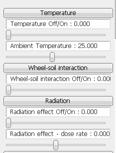
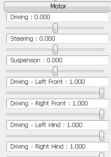
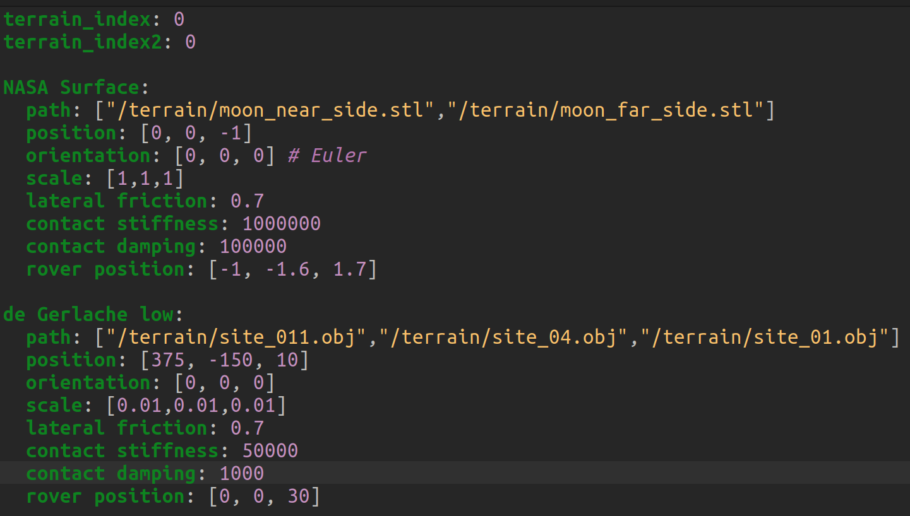
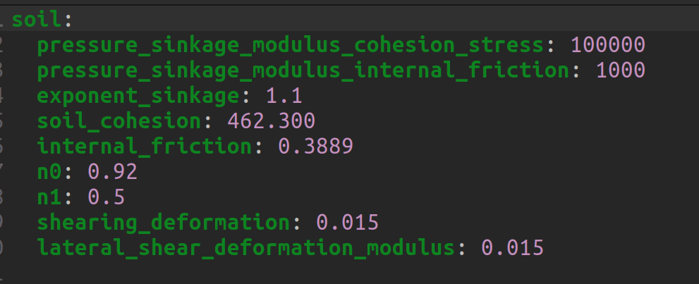

# Lunar-Rover-Simulator
This is the repository for the Lunar Rover Simulator test version, where only executable files exist. The full source code version will be released soon.


## Installation
This repo contains standalone executable files of the simulator with wrapped packages. So, further installation is not needed in this test version.

Linux (tested on x64 Ubuntu 22.04)
```sh
git clone https://github.com/assawayut/LunarRoverSim.git
cd linux
```

## Usage
### LUVMI-X model
```sh
cd linux
./main_luvmix
```

### VIPER model
```sh
cd linux
./main_viper
```

## Interface
Simulator GUI consists of the option to enable/disable each lunar environmental effect, the slider bars for applied torques, and the option to use camera sensors.

 


Since the source code is currently not accessible, the parameters can be changed or adjusted only in YAML files.
To change the terrain, as well as its dynamic properties, go to `init_config.yaml`, and change the number after `terrain_index` for the main type of terrain and/or after `terrain_index2` for the subtype of terrain.



To change the parameter values of lunar environment effect, go to `param_config.yaml`, and change the values after each parameter.



There are currently two control modes; *Individual motors control* and *Differential drive control*. TO change the mode, go to `init_config.yaml` and change the number after `control_mode`

## TODO
- Logger for the state of rover
- Test on Windows OS
